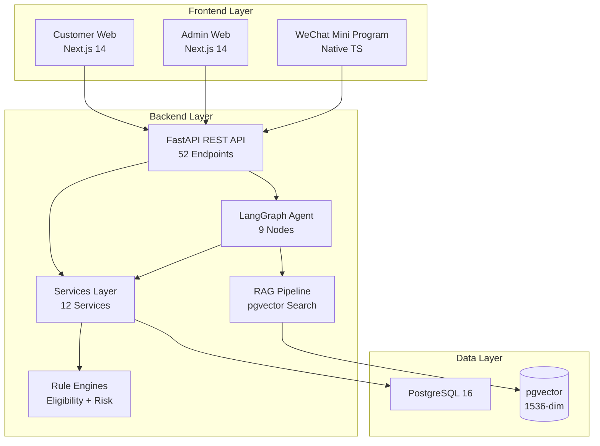
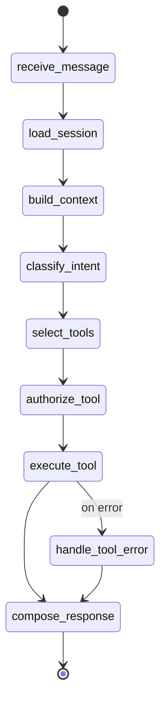
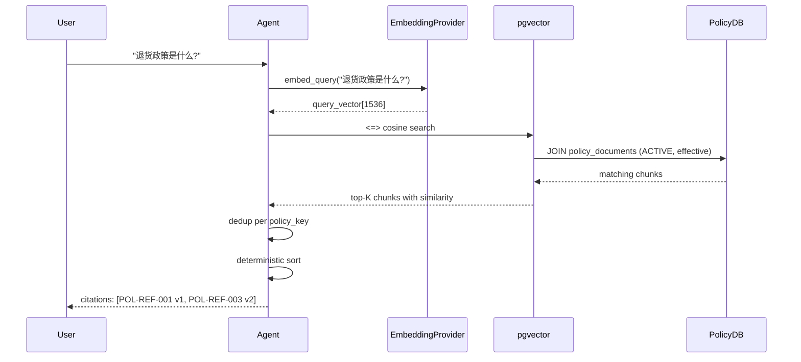
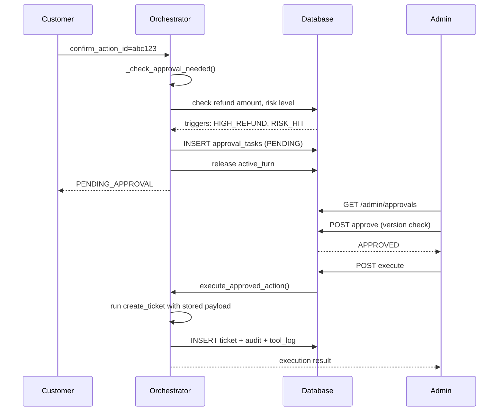
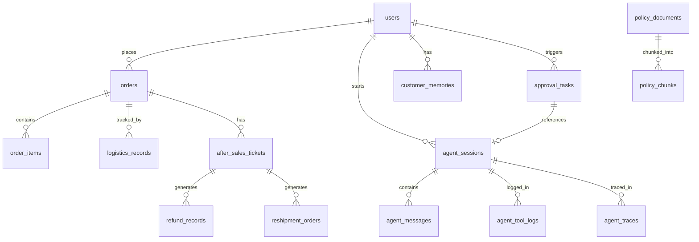
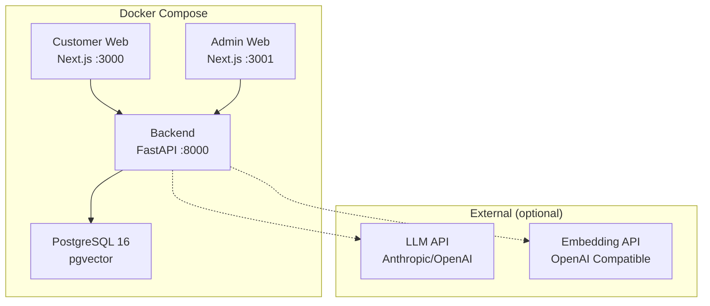

# Architecture & Design

## System Architecture

```mermaid
graph TB
    subgraph Frontend["Frontend Layer"]
        CW[Customer Web<br/>Next.js 14]
        AW[Admin Web<br/>Next.js 14]
        MP[WeChat Mini Program<br/>Native TS]
    end

    subgraph Backend["Backend Layer"]
        API[FastAPI REST API<br/>52 Endpoints]
        AGENT[LangGraph Agent<br/>9 Nodes]
        SVC[Services Layer<br/>12 Services]
        RULES[Rule Engines<br/>Eligibility + Risk]
        RAG[RAG Pipeline<br/>pgvector Search]
    end

    subgraph Data["Data Layer"]
        PG[PostgreSQL 16]
        PGV[(pgvector<br/>1536-dim)]
    end

    CW --> API
    AW --> API
    MP --> API
    API --> AGENT
    API --> SVC
    AGENT --> SVC
    AGENT --> RAG
    SVC --> RULES
    SVC --> PG
    RAG --> PGV
```

## Agent Execution Flow

```mermaid
stateDiagram-v2
    [*] --> receive_message
    receive_message --> load_session
    load_session --> build_context
    build_context --> classify_intent
    classify_intent --> select_tools
    select_tools --> authorize_tool
    authorize_tool --> execute_tool
    execute_tool --> compose_response
    execute_tool --> handle_tool_error: on error
    handle_tool_error --> compose_response
    compose_response --> [*]
```

## RAG Retrieval & Citation Flow

```mermaid
sequenceDiagram
    participant U as User
    participant A as Agent
    participant E as EmbeddingProvider
    participant P as pgvector
    participant D as PolicyDB

    U->>A: "退货政策是什么?"
    A->>E: embed_query("退货政策是什么?")
    E-->>A: query_vector[1536]
    A->>P: <=> cosine search
    P->>D: JOIN policy_documents (ACTIVE, effective)
    D-->>P: matching chunks
    P-->>A: top-K chunks with similarity
    A->>A: dedup per policy_key
    A->>A: deterministic sort
    A-->>U: citations: [POL-REF-001 v1, POL-REF-003 v2]
```

## HITL Approval Flow

```mermaid
sequenceDiagram
    participant C as Customer
    participant O as Orchestrator
    participant DB as Database
    participant AD as Admin

    C->>O: confirm_action_id=abc123
    O->>O: _check_approval_needed()
    O->>DB: check refund amount, risk level
    DB-->>O: triggers: HIGH_REFUND, RISK_HIT
    O->>DB: INSERT approval_tasks (PENDING)
    O->>DB: release active_turn
    O-->>C: PENDING_APPROVAL

    AD->>DB: GET /admin/approvals
    AD->>DB: POST approve (version check)
    DB-->>AD: APPROVED

    AD->>DB: POST execute
    DB->>O: execute_approved_action()
    O->>O: run create_ticket with stored payload
    O->>DB: INSERT ticket + audit + tool_log
    O-->>AD: execution result
```

## Database Core ER

```mermaid
erDiagram
    users ||--o{ orders : places
    users ||--o{ agent_sessions : starts
    users ||--o{ customer_memories : has
    users ||--o{ approval_tasks : triggers
    orders ||--o{ order_items : contains
    orders ||--o{ logistics_records : tracked_by
    orders ||--o{ after_sales_tickets : has
    after_sales_tickets ||--o{ refund_records : generates
    after_sales_tickets ||--o{ reshipment_orders : generates
    agent_sessions ||--o{ agent_messages : contains
    agent_sessions ||--o{ agent_tool_logs : logged_in
    agent_sessions ||--o{ agent_traces : traced_in
    policy_documents ||--o{ policy_chunks : chunked_into
    approval_tasks ||--o| agent_sessions : references
```

## Deployment Topology

```mermaid
graph TB
    subgraph Docker["Docker Compose"]
        PG[PostgreSQL 16<br/>pgvector]
        BE[Backend<br/>FastAPI :8000]
        CW[Customer Web<br/>Next.js :3000]
        AW[Admin Web<br/>Next.js :3001]
    end

    BE --> PG
    CW --> BE
    AW --> BE

    subgraph External["External (optional)"]
        LLM[LLM API<br/>Anthropic/OpenAI]
        EMB[Embedding API<br/>OpenAI Compatible]
    end

    BE -.-> LLM
    BE -.-> EMB
```
